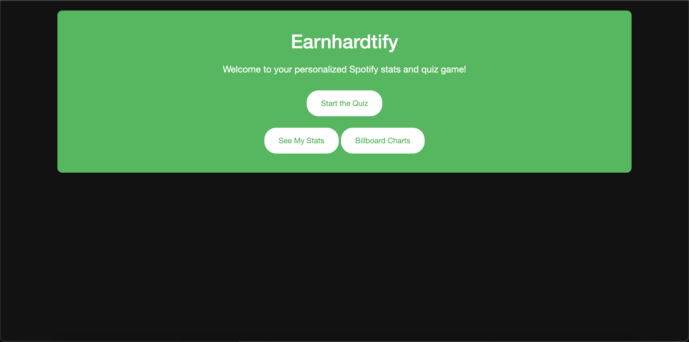
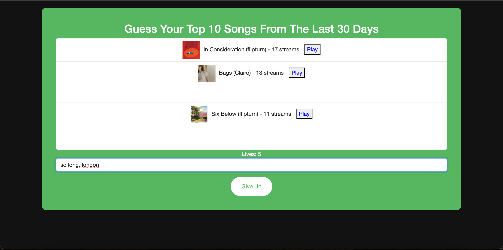
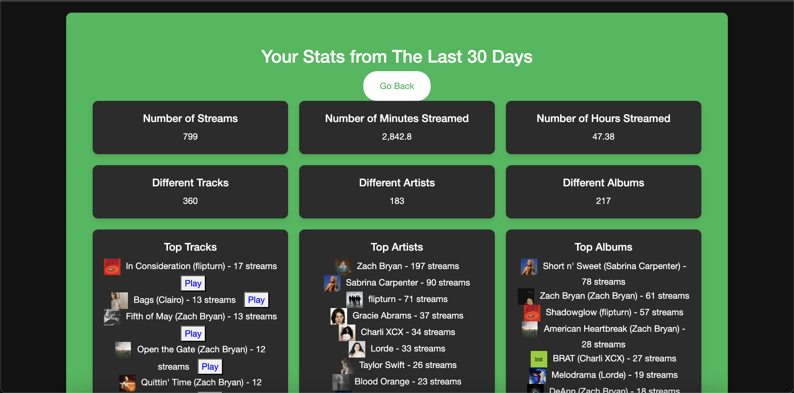
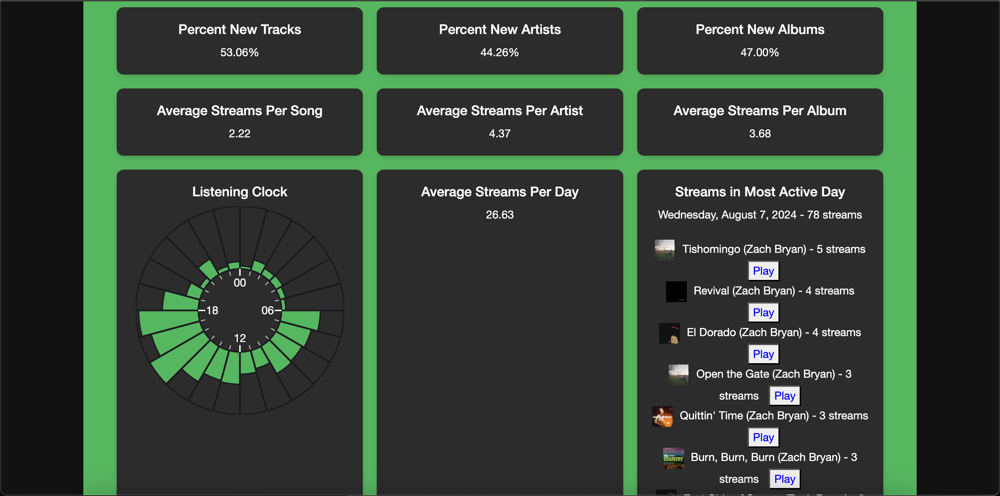

# Spotify Statistics Quiz

This project is a web application that I built as an anniversary gift. It uses users’ Spotify data to quiz them on their top songs, artists, and albums, while also providing detailed listening statistics. Users can select custom time ranges or choose from predefined options to tailor their experience.

## Overview

The Spotify Statistics Quiz offers a personalized and interactive way for users to engage with their Spotify listening data. By integrating Spotistats’s API, the app fetches data about the user’s most played songs, artists, and albums, and turns it into a fun and challenging quiz. Additionally, users receive detailed statistics about their listening habits, making it a comprehensive tool for music enthusiasts.

## Features

- **Personalized Quizzes:** Test your knowledge of your top tracks, artists, and albums based on your listening history.
- **Custom Time Ranges:** Choose from a custom time range or use predefined options like the last week, month, six months, or all-time.
- **Detailed Statistics:** View an in-depth analysis of your listening habits, including top tracks, artists, albums, and various listening metrics.

## Screenshots

### Home Screen

### Quiz Game

### Listening Stats Overview

### Detailed Listening Stats

## Future Enhancements

- **Expand Quiz Categories:** Include more categories such as genres, playlists, and collaborative filters.
- **Improved User Interface:** Enhance the UI/UX with more dynamic elements and customization options.
- **Social Features:** Allow users to compare their stats and quiz results with friends.

## License

This project is licensed under the MIT License. See the [LICENSE](LICENSE) file for more details.
